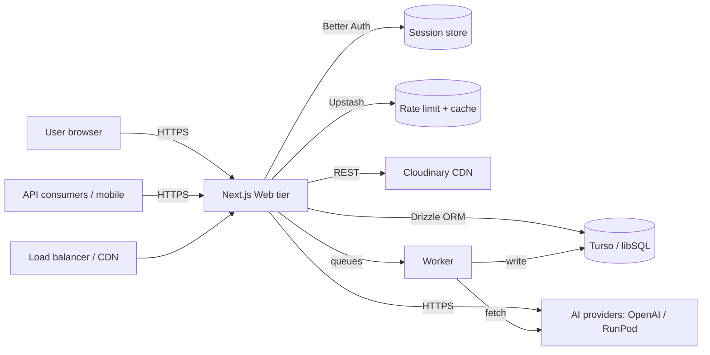

# Suitora — System Architecture

This document describes the high-level architecture of **Suitora**, an
AI-powered fashion compatibility platform. It is a living document: update it
whenever a major architectural change lands. Read it together with
[`CONTRIBUTING.md`](./CONTRIBUTING.md) for development conventions.

- [System Context](#system-context)
- [Technology Stack](#technology-stack)
- [Directory Structure](#directory-structure)
- [Key Architectural Decisions](#key-architectural-decisions)
- [Data Flow](#data-flow)
- [Caching & Session Strategy](#caching--session-strategy)
- [Security Considerations](#security-considerations)
- [Observability](#observability)
- [Scaling Strategy](#scaling-strategy)
- [Deployment Topology](#deployment-topology)
- [Known Technical Debt & Roadmap](#known-technical-debt--roadmap)

## System Context



### External dependencies

| Dependency              | Purpose                                              |
|-------------------------|------------------------------------------------------|
| Turso / libSQL          | Primary database (SQLite compatible)                 |
| Turso replica (optional)| Read replica for dashboards/favorites/trend reads    |
| Upstash Redis           | Sliding-window rate limiting + trend/analysis cache  |
| Cloudinary              | Image upload, optimization, and CDN delivery         |
| OpenAI (Vision)         | AI image analysis (aspects, style, color)            |
| RunPod                  | Virtual try-on inference (webhook-driven)            |
| S3-compatible storage   | Database backup dumps (see `runbooks/`)              |

## Technology Stack

| Layer       | Technology                                              |
|-------------|---------------------------------------------------------|
| Framework   | Next.js 16 (App Router), React 19                       |
| Language    | TypeScript (strict)                                     |
| Styling     | Tailwind CSS v4 with design tokens                      |
| Database    | Drizzle ORM over Turso / libSQL                         |
| Auth        | Better Auth (sessions, OAuth, email/password)           |
| Forms       | React Hook Form + Zod                                   |
| Client data | SWR (client-side fetching where required)               |
| Backend     | Next.js Route Handlers + background worker (`tsx`)      |
| Metrics     | prom-client + OpenTelemetry                             |
| Logging     | pino (structured JSON)                                  |
| Animations  | Framer Motion                                           |
| Testing     | Vitest, Cypress, SuperTest                              |

## Directory Structure

```
app/           Next.js App Router — pages and API route handlers
components/    Reusable React components (UI, layout, feature-scoped)
features/      Feature-scoped business logic and components
hooks/         Shared React hooks
lib/           Core libraries (see below)
services/      Long-running processes (web/api/worker)
worker/        Background worker entrypoint
actions/       Server Actions
types/         Shared TypeScript types
utils/         Pure utility functions
db/            Database access layer
drizzle/       Drizzle schema, client, and SQL migrations
jobs/          Scheduled jobs (backup, restore, trend sync, health check)
scripts/       Standalone scripts (migrations, rollback)
docs/          Long-form documentation (API spec, architecture, runbooks)
runbooks/      Operational incident runbooks
```

### `lib/` core modules

| Module             | Responsibility                                              |
|--------------------|-------------------------------------------------------------|
| `lib/auth/`        | Better Auth wiring, session helpers, auth server actions    |
| `lib/db/`          | Drizzle queries, filtering helpers, dump/restore utilities  |
| `lib/ai/`          | Vision analysis, fit pipeline, body estimation, size prediction, outfit recommender, stylist, try-on |
| `lib/trend/`       | Trending-item providers, normalize, rank, cache, sync       |
| `lib/api/`         | Route handler helpers: request parsing, response envelope, error types |
| `lib/storage/`     | Cloudinary + S3 abstractions                                |
| `lib/security/`    | SSRF protection and other security helpers                  |
| `lib/metrics.ts`   | prom-client metric registry                                 |
| `lib/rate-limit.ts`| Upstash Redis sliding-window limiter (in-memory fallback)   |
| `lib/cache.ts`     | Reusable caching helpers                                    |
| `lib/env.ts`       | Centralized env validation (server schema)                  |

## Key Architectural Decisions

1. **Server Components by default.** Pages prefer RSC; `"use client"` is added
   only where interactivity, local state, or browser APIs are required. This
   minimizes client JavaScript and improves time-to-interactive.

2. **Route Handlers for the API.** Next.js Route Handlers implement the public
   API under `app/api/*`. All responses follow a consistent envelope
   (`{ success, data, message }`) and all errors use a shared envelope with a
   stable error code and a `requestId` for correlation.

3. **Drizzle ORM with typed queries.** No raw SQL where Drizzle supports it.
   Schema lives in `drizzle/schema.ts`; timed, hand-written SQL migrations are
   the convention for structural changes.

4. **Read-replica friendly.** A dedicated `TURSO_REPLICA_URL` lets
   dashboard/favorites/trend reads offload from the primary, keeping write
   latency predictable as read load grows.

5. **External AI behind providers, with a mock fallback.** AI features route
   through provider abstractions (`lib/ai/providers`, `lib/trend/providers`)
   so development and tests run against deterministic mock providers.

6. **Rate limiting as infrastructure.** Upstash Redis provides a distributed
   sliding-window limiter; an in-memory fallback keeps local development
   functional without external services.

7. **Background work isolated in a worker.** Try-on inference and long-running
   sync (e.g. trending items) run in a separate worker process, keeping web
   request latency stable.

## Data Flow

### Authentication

```
Login/Register -> Better Auth (lib/auth) -> create session -> session cookie
-> protected routes validate session (lib/auth/session) -> 401 if invalid
```

Session data lives in the database via the Better Auth adapter. Every protected
route checks the session server-side before serving data.

### AI Analysis (fashion compatibility)

```
Upload images -> Cloudinary -> fit pipeline (lib/ai/fit-pipeline)
  -> vision provider (lib/ai/vision) -> body estimation, item attributes
  -> fit scoring (lib/ai/fit-scoring) -> persist analysis -> result page
```

The pipeline is provider-agnostic and falls back to a mock analysis in
development and when a provider is unavailable.

### Virtual Try-On

```
Request try-on -> enqueue job -> worker submits to RunPod -> RunPod POSTs back
  to /api/tryon/webhook -> results persisted -> user polls status
```

### Trending Items

```
Worker sync job -> providers (lib/trend/providers) -> normalize
  -> rank -> cache (Upstash) -> reads served from cache with TTL
```

## Caching & Session Strategy

- **Session cache / rate limit:** Upstash Redis, TTL-based.
- **Trend/analysis caching:** cached in Redis; uncompressed in-memory fallbacks
  for development.
- **Static pages:** Next.js App Router static generation/ISR for public,
  low-churn pages.
- **Images:** Cloudinary URLs handled by `next/image` optimization.
- **No client-side caching of protected data** — fresh server reads per
  request, gated by an authenticated session.

## Security Considerations

- **No secrets in the client bundle.** Env vars are validated centrally
  (`lib/env.ts`) and only `NEXT_PUBLIC_` vars are exposed.
- **SSRF protection** on outbound fetches (`lib/security/ssrf.ts`).
- **Input validation** with Zod on all server boundaries (`lib/validation.ts`).
- **Auth enforced** on API routes, Server Actions, and protected pages.
- **Rate limiting** on API endpoints (429 + `Retry-After`).
- **CORS** restricted to an allow-list of trusted origins.
- **File upload validation** — type/size checks server-side.

See `SECURITY.md` for the full security policy.

## Observability

- **Metrics:** prom-client registry exposed at `/metrics`; alerting rules cover
  error rate, latency, provider failure, heap, and DB health (see
  `docs/runbooks.md`).
- **Logs:** pino structured JSON, correlated by `requestId`/`trace_id` via
  OpenTelemetry. Every response carries an `X-Request-Id` header.
- **Dashboards:** a `Suitora Overview` Grafana dashboard aggregates the above.

## Scaling Strategy

- **Horizontal scaling of the web tier.** Stateless web replicas behind a load
  balancer/CDN; session state and rate limits are externalized (DB + Redis) so
  any replica can serve any request.
- **Database.** Turso primary for writes; optional read replica (`TURSO_REPLICA_URL`)
  offloads read-heavy endpoints. Connection pooling is configurable
  (`DB_POOL_SIZE`).
- **Background work.** The worker scales independently of the web tier; the
  queue is resilient to restarts.
- **Asset delivery.** Cloudinary CDN offloads image bandwidth.
- **Blue-green / canary deploys.** Kubernetes manifests and CI workflows
  support zero-downtime blue-green promotion with canary traffic splits
  (see `k8s/` and `deploy/`).

## Deployment Topology

- **Staging & production** deploy via CI (GitHub Actions) on pushes to `main`
  (staging) and on version tags / manual dispatch (production blue-green).
- **Vercel** is the recommended hosting path for the Next.js app (see
  `README.md`).
- **Secrets** are injected from the platform's secret manager — never stored
  in the repo.

## Known Technical Debt & Roadmap

- Real AI provider coverage is in progress; mocks remain the default until
  production keys are provisioned.
- The README API table predates the full OpenAPI spec; the OpenAPI spec at
  `docs/api/swagger.yaml` is the source of truth and the README table should be
  kept in sync or replaced with a link to `/api/docs`.
- Some dashboards/metrics thresholds are initial estimates and should be
  revisited with real traffic.
- Planned: mobile app (React Native) and browser extension reuse the
  OpenAPI contract for SDK generation.
