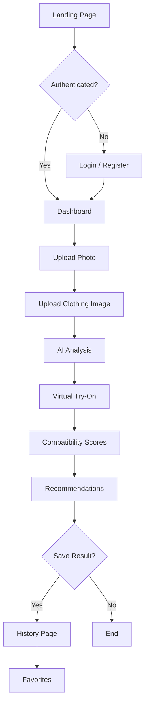
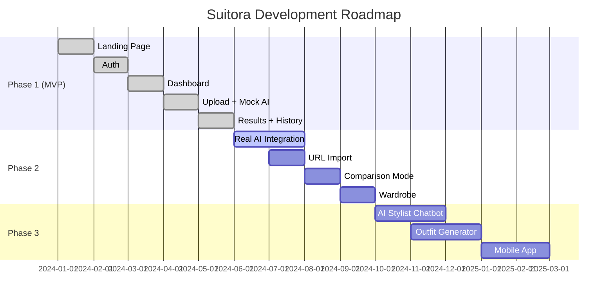

# Suitora — AI Fashion Compatibility Platform

> **Know if it suits you before you buy.**  
> Suitora is an AI-powered fashion assistant that helps users make smarter purchasing decisions by providing virtual try-on, compatibility scoring, and personalized style recommendations.


---

## 📖 Table of Contents

- [Vision](#-vision)
- [Features](#-features)
- [Tech Stack](#-tech-stack)
- [User Flow](#-user-flow)
- [Getting Started](#-getting-started)
- [Project Structure](#-project-structure)
- [Database Schema](#-database-schema)
- [AI Workflow](#-ai-workflow)
- [UI Design System](#-ui-design-system)
- [Pages & Components](#-pages--components)
- [API Reference](#-api-reference)
- [Roadmap](#-roadmap)
- [Security](#-security)
- [Performance](#-performance)
- [Accessibility](#-accessibility)
- [SEO](#-seo)
- [Deployment](#-deployment)
- [Contributing](#-contributing)
- [License](#-license)

---

## 🎯 Vision

Become the leading AI shopping companion that eliminates the uncertainty in online fashion purchases. Instead of wondering *"Will this shirt actually look good on me?"*, Suitora provides an AI-generated answer with:

- **Virtual try-on** — See how clothing fits your body
- **Compatibility scores** — Data-driven fit, color, and style analysis
- **Personalized recommendations** — Tailored fashion advice based on your unique profile

---

## ✨ Features

### Phase 1 (MVP) ✅

| Feature | Status |
|---------|--------|
| Landing page with Hero, Features, How It Works, FAQ | ✅ Built |
| Authentication (Login, Register, Forgot Password) | ✅ Built (UI + validation) |
| Dashboard with stats, recent analyses, quick actions | ✅ Built |
| Image upload with drag-and-drop, preview, validation | ✅ Built |
| Mock AI analysis workflow with progress animation | ✅ Built |
| Results page with compatibility scores & recommendations | ✅ Built |
| Analysis history with search, sort, delete | ✅ Built |
| Favorites management | ✅ Built |
| Settings (Profile, Password, Appearance, Subscription) | ✅ Built |
| Responsive design | ✅ Built |
| Dark/light mode support | ✅ Built |
| Sidebar navigation | ✅ Built |

### Phase 2 (In Progress)

- [ ] Real AI integration (OpenAI Vision / Gemini Vision)
- [ ] Paste product URL to auto-extract clothing image
- [ ] Multiple outfit comparison
- [ ] Favorite items & wardrobe management
- [ ] Cloudinary image hosting

### Phase 3 (Planned)

- [ ] AI stylist chatbot
- [ ] Outfit recommendation engine
- [ ] Similar clothing suggestions
- [ ] Color palette recommendations
- [ ] Seasonal fashion advice

### Future

- [ ] Mobile app (React Native)
- [ ] Chrome Extension for browser shopping assistant
- [ ] Affiliate integration with online retailers
- [ ] Social sharing & community features
- [ ] AI outfit generation

---

## 🛠 Tech Stack

### Frontend

| Technology | Purpose |
|-----------|---------|
| [Next.js 16](https://nextjs.org/) (App Router) | React framework with SSR, RSC, and file-based routing |
| [TypeScript](https://www.typescriptlang.org/) | Type-safe development |
| [Tailwind CSS v4](https://tailwindcss.com/) | Utility-first styling with design tokens |
| [Framer Motion](https://www.framer.com/motion/) | Declarative animations and micro-interactions |
| [React Hook Form](https://react-hook-form.com/) | Performant form management |
| [Zod](https://zod.dev/) | Schema validation for forms and data |
| [Lucide React](https://lucide.dev/) | Consistent, beautiful icon library |

### Backend

| Technology | Purpose |
|-----------|---------|
| [Next.js Route Handlers](https://nextjs.org/docs/app/building-your-application/routing/route-handlers) | API endpoints |
| [Drizzle ORM](https://orm.drizzle.team/) | Type-safe SQL query builder |
| [Turso](https://turso.tech/) | Edge-hosted SQLite database |
| [Better Auth](https://www.better-auth.com/) | Authentication framework |
| [Sharp](https://sharp.pixelplumbing.com/) | Image processing |

### Storage & AI

| Technology | Purpose |
|-----------|---------|
| [Cloudinary](https://cloudinary.com/) | Image upload, optimization, and CDN |
| [OpenAI Vision](https://platform.openai.com/) | AI image analysis (future) |
| [Gemini Vision](https://deepmind.google/technologies/gemini/) | AI image analysis (future) |

### Deployment

| Platform | Purpose |
|---------|---------|
| [Vercel](https://vercel.com/) | Frontend + API hosting |
| [Turso](https://turso.tech/) | Edge database |

---

## 🔄 User Flow



---

## 🚀 Getting Started

### Prerequisites

- **Node.js** 18+ (LTS recommended)
- **npm** or **yarn** or **pnpm**
- **Turso CLI** (optional, for database management)

### Installation

1. **Clone the repository**

   ```bash
   git clone https://github.com/your-username/suitora.git
   cd suitora
   ```

2. **Install dependencies**

   ```bash
   npm install
   ```

3. **Set up environment variables**

   ```bash
   cp .env.example .env.local
   ```

   Edit `.env.local` with your credentials:

   ```env
   # Database
   TURSO_DATABASE_URL=libsql://your-database.turso.io
   TURSO_AUTH_TOKEN=your-auth-token

   # Authentication
   BETTER_AUTH_SECRET=your-secret-key
   BETTER_AUTH_URL=http://localhost:3000

   # Cloudinary (optional for Phase 2+)
   NEXT_PUBLIC_CLOUDINARY_CLOUD_NAME=your-cloud-name
   CLOUDINARY_API_KEY=your-api-key
   CLOUDINARY_API_SECRET=your-api-secret

   # AI (for real AI integration)
   OPENAI_API_KEY=your-openai-key
   ```

4. **Run database migrations**

   ```bash
   npx drizzle-kit push
   ```

5. **Start development server**

   ```bash
   npm run dev
   ```

   Open [http://localhost:3000](http://localhost:3000) in your browser.

### Available Scripts

| Command | Description |
|---------|-------------|
| `npm run dev` | Start development server |
| `npm run build` | Production build |
| `npm run start` | Start production server |
| `npm run lint` | Run ESLint |
| `npx drizzle-kit push` | Push schema to database |
| `npx drizzle-kit generate` | Generate migration files |
| `npx drizzle-kit migrate` | Run pending migrations |

---

## 📁 Project Structure

```
suitora/
├── app/                          # Next.js App Router pages
│   ├── (landing)/                # Landing page route group
│   │   ├── layout.tsx            # Landing layout (Navbar + Footer)
│   │   └── page.tsx              # Landing page (Hero, Features, FAQ)
│   ├── (auth)/                   # Auth route group
│   │   ├── login/page.tsx        # Login page
│   │   ├── register/page.tsx     # Registration page
│   │   └── forgot-password/      # Password reset page
│   ├── (dashboard)/              # Dashboard route group
│   │   ├── layout.tsx            # Dashboard layout (Sidebar)
│   │   ├── dashboard/page.tsx    # Dashboard overview
│   │   ├── upload/page.tsx       # Image upload page
│   │   ├── analysis/page.tsx     # AI analysis processing
│   │   ├── results/[id]/page.tsx  # Analysis results
│   │   ├── history/page.tsx      # Analysis history
│   │   ├── favorites/page.tsx    # Saved favorites
│   │   └── settings/page.tsx     # User settings
│   ├── layout.tsx                # Root layout (fonts, providers)
│   ├── globals.css               # Design system & CSS variables
│   ├── not-found.tsx             # Custom 404 page
│   ├── error.tsx                 # Global error boundary
│   └── loading.tsx               # Global loading state
├── components/                   # Reusable UI components
│   ├── ui/                       # Base UI primitives
│   │   ├── Button.tsx
│   │   ├── Input.tsx
│   │   ├── Card.tsx
│   │   ├── Badge.tsx
│   │   ├── Avatar.tsx
│   │   ├── ScoreCircle.tsx
│   │   ├── Skeleton.tsx
│   │   ├── Toast.tsx
│   │   └── index.ts
│   ├── layout/                   # Layout components
│   │   ├── Navbar.tsx            # Landing page navbar
│   │   ├── Sidebar.tsx           # Dashboard sidebar
│   │   └── Footer.tsx           # Landing page footer
│   ├── landing/                  # Landing page sections
│   ├── dashboard/                # Dashboard widgets
│   ├── upload/                   # Upload components
│   └── analysis/                 # Analysis components
├── lib/                          # Core libraries
│   ├── ai/                       # AI services
│   │   ├── mock-analysis.ts      # Mock AI analysis
│   │   └── upload.ts             # Mock image upload
│   ├── auth/                     # Auth utilities
│   ├── db/                       # Database access
│   │   └── queries.ts            # Query functions
│   ├── utils/                    # Utility functions
│   │   ├── cn.ts                 # Class name merger
│   │   ├── format.ts             # Formatting helpers
│   │   ├── id.ts                 # ID generation
│   │   └── validation.ts         # Zod schemas
├── types/                        # TypeScript type definitions
│   └── index.ts                  # Core types (User, Analysis, etc.)
├── drizzle/                      # Database
│   ├── schema.ts                 # Drizzle ORM schema
│   ├── index.ts                  # Database client
│   └── migrations/               # Migration files
├── drizzle.config.ts             # Drizzle Kit configuration
├── public/                       # Static assets
│   └── images/                   # Image assets
├── styles/                       # Additional styles
├── hooks/                        # React hooks
├── services/                     # External service integrations
├── actions/                      # Server actions
├── next.config.ts                # Next.js configuration
├── tailwind.config.ts            # Tailwind CSS configuration
├── tsconfig.json                 # TypeScript configuration
├── postcss.config.mjs            # PostCSS configuration
├── .env.example                  # Environment variable template
└── package.json                  # Dependencies & scripts
```

---

## 🗄 Database Schema

### Users

| Column | Type | Constraints |
|--------|------|-------------|
| `id` | `text` | Primary Key |
| `name` | `text` | Not Null |
| `email` | `text` | Not Null, Unique |
| `emailVerified` | `integer` (boolean) | Default `false` |
| `image` | `text` | Nullable |
| `createdAt` | `text` | Default `CURRENT_TIMESTAMP` |
| `updatedAt` | `text` | Default `CURRENT_TIMESTAMP` |

### Sessions

| Column | Type | Constraints |
|--------|------|-------------|
| `id` | `text` | Primary Key |
| `userId` | `text` | Foreign Key → users, Cascade Delete |
| `expiresAt` | `integer` | Not Null |
| `createdAt` | `text` | Default `CURRENT_TIMESTAMP` |

### Analyses

| Column | Type | Constraints |
|--------|------|-------------|
| `id` | `text` | Primary Key |
| `userId` | `text` | Foreign Key → users, Cascade Delete |
| `userImage` | `text` | Not Null |
| `productImage` | `text` | Not Null |
| `generatedImage` | `text` | Nullable |
| `overallScore` | `real` | Default `0` |
| `bodyScore` | `real` | Nullable |
| `styleScore` | `real` | Nullable |
| `colorScore` | `real` | Nullable |
| `bodyShape` | `text` | Nullable |
| `skinTone` | `text` | Nullable |
| `faceShape` | `text` | Nullable |
| `styleType` | `text` | Nullable |
| `recommendations` | `text` (JSON) | Nullable |
| `colorAnalysis` | `text` (JSON) | Nullable |
| `createdAt` | `text` | Default `CURRENT_TIMESTAMP` |

### Favorites

| Column | Type | Constraints |
|--------|------|-------------|
| `id` | `text` | Primary Key |
| `userId` | `text` | Foreign Key → users, Cascade Delete |
| `analysisId` | `text` | Foreign Key → analyses, Cascade Delete |
| `createdAt` | `text` | Default `CURRENT_TIMESTAMP` |

---

## 🤖 AI Workflow

```
User Image Upload
       ↓
   Detect Person
       ↓
   Remove Background
       ↓
   Analyze Body
   ├── Body Shape (Rectangle, Pear, Apple, Hourglass, Triangle)
   ├── Skin Tone (Warm, Cool, Neutral)
   ├── Face Shape (Round, Oval, Heart, Square, Diamond)
   └── Pose Detection
       ↓
Clothing Image Upload
       ↓
   Extract Clothing
       ↓
   Virtual Try-On Generation
       ↓
   Generate Final Image
       ↓
   Fashion Analysis
       ↓
   Return Result
```

### Analysis Categories

| Category | Values |
|----------|--------|
| **Body Shape** | Rectangle, Pear, Apple, Hourglass, Triangle |
| **Skin Tone** | Warm, Cool, Neutral |
| **Face Shape** | Round, Oval, Heart, Square, Diamond |
| **Style** | Casual, Minimalist, Streetwear, Vintage, Formal, Korean, Business Casual |
| **Color Analysis** | Primary Colors, Recommended Colors, Avoid Colors |

### Compatibility Score

The overall score (0–100) is computed from:

- **Color Harmony** — How well the clothing colors match the user's skin tone
- **Body Fit** — How well the garment complements the user's body shape
- **Style Match** — How the item aligns with the user's detected style type
- **Clothing Fit** — Cut, silhouette, and proportion analysis

---

## 🎨 UI Design System

### Theme Inspiration

The UI is inspired by modern, premium design language from:

- **Apple** — Clean typography, generous whitespace, precise alignment
- **Linear** — Minimal interface, subtle gradients, smooth animations
- **Arc Browser** — Rounded corners, glass morphism, sidebar navigation
- **OpenAI** — Purple accent palette, glowing effects, card-based layouts

### Color Palette

| Token | Light | Dark |
|-------|-------|------|
| Background | `#FAFAFA` | `#09090B` |
| Foreground | `#09090B` | `#FAFAFA` |
| Primary | `#5B4BFF` | `#6B5BFF` |
| Accent | `#8B5CF6` | `#9D7AF8` |
| Card | `#FFFFFF` | `#18181B` |
| Border | `#E4E4E7` | `#27272A` |
| Surface | `#F4F4F5` | `#18181B` |
| Success | `#10B981` | `#10B981` |
| Warning | `#F59E0B` | `#F59E0B` |
| Error | `#EF4444` | `#EF4444` |

### Typography

| Property | Value |
|----------|-------|
| Font Family | Inter (system-ui fallback) |
| Scale | Large headings, generous line height |
| Mono | JetBrains Mono |

### Components

- **Button** — 4 variants (primary, secondary, ghost, outline, danger), 4 sizes (sm, md, lg, xl), loading state
- **Input** — Label, error, and hint support with focus ring
- **Card** — Glass morphism, hover elevation, header/title/content/footer
- **Badge** — 6 color variants (default, primary, success, warning, error, accent)
- **ScoreCircle** — Circular SVG progress indicator with animated arc
- **Skeleton** — Shimmer loading placeholder
- **Toast** — Context-based notification system with 4 types (success, error, info, warning)
- **Avatar** — Image or initials fallback, 4 sizes

### Animations

- **Framer Motion** for all transitions
- Fade in, slide up, scale in on page load
- Hover scaling on cards and interactive elements
- Micro-interactions on buttons (scale on active)
- Loading skeleton shimmer animation
- Progress bar animation during analysis
- Accordion FAQ expand/collapse

---

## 📄 Pages & Components

### Landing Page (`/`)

- **Hero** — Animated headline, gradient text, social proof, CTA
- **Features** — 6-card grid with gradient icons and hover effects
- **How It Works** — 4-step connected workflow with numbered circles
- **FAQ** — Accordion with smooth open/close animation
- **CTA** — Final call-to-action with arrow icon

### Authentication

- **Login** (`/login`) — Email + password with show/hide toggle, Zod validation
- **Register** (`/register`) — Name, email, password, confirm with validation
- **Forgot Password** (`/forgot-password`) — Email input with success state

### Dashboard (`/dashboard`)

- **Stats Grid** — 4 stat cards (total analyses, avg score, favorites, weekly)
- **Quick Actions** — 3 action cards (Upload, History, Settings)
- **Recent Analyses** — List with scores, badges, timestamps, empty state

### Upload (`/upload`)

- Dual upload areas for user photo and clothing item
- Drag-and-drop with visual feedback
- Client-side file type and size validation (5MB max)
- Image preview with remove button
- Upload success badge

### Analysis (`/analysis`)

- Animated logo with rotation pulse
- Progress bar with percentage
- Stage indicators: Detecting → Analyzing → Try-On → Scoring → Complete
- Loading dots animation
- Error state with retry

### Results (`/results/[id]`)

- Back navigation
- Save/Share/Download actions
- Virtual Try-On / Original toggle
- 4 ScoreCircle displays (Overall, Body, Style, Color)
- Style Profile grid (Body Shape, Skin Tone, Face Shape, Style Type)
- Color Analysis with swatches and badges
- Numbered Recommendations list
- "Try Another Item" CTA

### History (`/history`)

- Search bar with filter
- Sort by: Newest, Highest Score, Lowest Score
- Grid of analysis cards with score badges
- Favorite and Delete actions on hover
- Empty state

### Favorites (`/favorites`)

- Selection of saved analyses
- Remove from favorites
- Empty state

### Settings (`/settings`)

- Sidebar tabs: Profile, Password, Appearance, Subscription
- **Profile** — Avatar upload, name, email
- **Password** — Current, new, confirm fields
- **Appearance** — Light/Dark mode toggle, notification toggle
- **Subscription** — Current plan display with features list

### Error Pages

- **404** (`/not-found`) — Friendly message with home button
- **Error** (`/error`) — Recoverable error boundary with retry
- **Loading** (`/loading`) — Animated logo with pulsing text

---

## 🌐 API Reference

| Endpoint | Method | Description |
|----------|--------|-------------|
| `/api/auth/*` | — | Better Auth endpoints |
| `/api/upload` | `POST` | Upload image to Cloudinary |
| `/api/analyze` | `POST` | Run AI fashion analysis |
| `/api/history` | `GET` | Get user's analysis history |
| `/api/profile` | `GET` | Get user profile |
| `/api/favorites` | `GET` / `POST` / `DELETE` | Manage favorites |

---

## 🛣 Roadmap



---

## 🔒 Security

- **File upload validation** — Type and size checks on client and server
- **Rate limiting** — Prevent abuse of API endpoints
- **Server-side validation** — Zod schemas validate all inputs
- **Input sanitization** — Prevent XSS and injection attacks
- **Secure authentication** — Better Auth with session management
- **Environment variables** — Secrets never exposed to client
- **HTTPS** — Enforced in production
- **CORS** — Restrict API access to authorized origins

---

## ⚡ Performance

- **Image optimization** — Next.js Image component with lazy loading
- **Server Components** — Minimal client JavaScript
- **Client Components** — Only used where interactivity is required
- **Dynamic imports** — Code splitting for heavy components
- **Caching** — Static pages with ISR where possible
- **Streaming** — Suspense boundaries for progressive rendering
- **Parallel routes** — Independent loading of page sections

---

## ♿ Accessibility

- **Keyboard navigation** — All interactive elements are keyboard accessible
- **ARIA labels** — Descriptive labels for screen readers
- **Focus states** — Visible focus rings on interactive elements
- **Color contrast** — WCAG AA compliant color ratios
- **Semantic HTML** — Proper heading hierarchy and landmark elements
- **Reduced motion** — Respects `prefers-reduced-motion`

---

## 🔍 SEO

- **Metadata API** — Per-page titles, descriptions, Open Graph
- **Structured data** — JSON-LD for rich search results
- **Open Graph** — Social media preview cards
- **Twitter Card** — Twitter sharing previews
- **Sitemap** — `sitemap.xml` for search engine crawlers
- **Robots** — `robots.txt` for crawl instructions
- **Canonical URLs** — Prevent duplicate content issues

---

## 🚢 Deployment

### Vercel (Recommended)

1. Push to GitHub
2. Import repository in Vercel
3. Set environment variables in Vercel dashboard
4. Deploy

### Environment Variables

| Variable | Description |
|----------|-------------|
| `TURSO_DATABASE_URL` | Turso database URL |
| `TURSO_AUTH_TOKEN` | Turso authentication token |
| `BETTER_AUTH_SECRET` | Better Auth secret key |
| `BETTER_AUTH_URL` | Application URL |
| `NEXT_PUBLIC_CLOUDINARY_CLOUD_NAME` | Cloudinary cloud name |
| `CLOUDINARY_API_KEY` | Cloudinary API key |
| `CLOUDINARY_API_SECRET` | Cloudinary API secret |
| `OPENAI_API_KEY` | OpenAI API key (for real AI) |

---

## 🤝 Contributing

1. Fork the repository
2. Create a feature branch (`git checkout -b feature/amazing-feature`)
3. Commit your changes (`git commit -m 'Add amazing feature'`)
4. Push to the branch (`git push origin feature/amazing-feature`)
5. Open a Pull Request

### Coding Standards

- **Strict TypeScript** — `strict: true` in tsconfig
- **SOLID Principles** — Single responsibility, dependency injection
- **Reusable Components** — DRY, composable UI primitives
- **Feature-based organization** — Group by feature, not by type
- **Server Components by default** — Use `"use client"` only when needed
- **Proper error handling** — Error boundaries, try/catch, fallbacks
- **Comprehensive documentation** — JSDoc comments for public APIs

---

## 📄 License

This project is private and proprietary. All rights reserved.

---

## 🙏 Acknowledgments

- Design inspiration from [Apple](https://apple.com), [Linear](https://linear.app), [Arc Browser](https://arc.net), and [OpenAI](https://openai.com)
- Built with [Next.js](https://nextjs.org), [Tailwind CSS](https://tailwindcss.com), [Framer Motion](https://framer.com/motion), and many other amazing open-source projects

---

<p align="center">
  Made with ❤️ for fashion lovers everywhere
</p>
